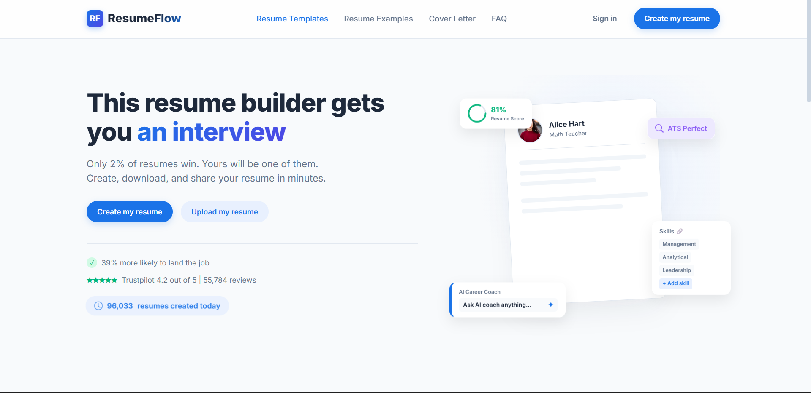
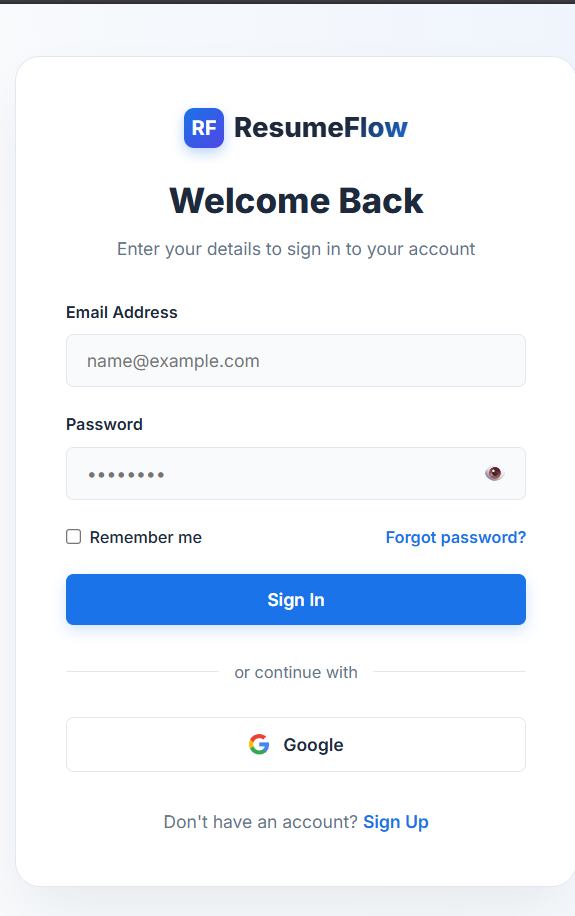

# 🚀 ResumeFlow

A modern and responsive Resume Builder that helps users create professional and ATS-friendly resumes with a clean and user-friendly interface.

## ✨ Features

- 🔐 User Authentication
- 📄 Create & Manage Resume
- 📱 Responsive Design
- ⚡ Clean & Modern UI

## 🛠️ Tech Stack

- HTML5
- CSS3
- JavaScript

## 📸 Screenshots

### Home Page

### Login Page

## 🚀 Getting Started

1. Clone the repository.
2. Open the project folder in your browser, or use a local server such as Live Server.
3. Start with the landing page and explore the resume builder.

---

⭐ If you like this project, consider giving it a star!
